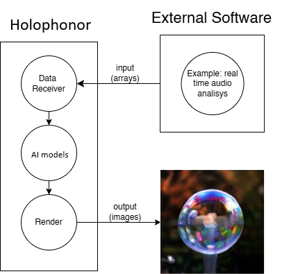

# Holophonor

**The idea:** The idea was born when I asked myself: what would happen if I connect a live audio source to a neural network? Well, this repository is the answer. I've lately found out that it resembles for many people [the Futurama holophonor instrument](https://www.youtube.com/watch?v=gPn8ytmg0pE), hence the name of this repository.


Discord community: https://discord.gg/YpamA34C3
## Media

4 videos of the software in action using an audio source as input are available here:

[](https://www.youtube.com/watch?v=a0NKAyqA8PY)
[](https://www.youtube.com/watch?v=OnulUUTbFZ8)
[](https://youtu.be/tjcyJaYmcws) 
[](https://youtu.be/Q0MYGuqTHHc)


## What is Holophonor?

Holophonor is a software that generates images in real time. It leverages neural networks (a subset of the artificial intelligence domain) to do so. By default, it uses Google Deepmind BigGan which comprehends [1000 subjects](https://gist.github.com/yrevar/942d3a0ac09ec9e5eb3a). Since I wanted to use it with audio as input source, I've alsoforked and edited [friture](https://github.com/Novecento99/friture), a software able to analyze audio in real time.

## How does it work?


The framework works by capturing data from an UDP connection and feeding it to the GAN model. The model generates an image based on the input data, which is then displayed on the screen. The process is repeated in real-time, creating a dynamic and interactive visualization that responds to external input.

Specifically, the framework can be used to create visualizations that respond to audio input, such as music or environmental sounds. The visualizations can be customized by changing the LiuNet model, the input data source, and other parameters.


# How to run Holophonor

Holophonor can be run by following the instructions below.

I've built an executable version of Holophonor and Friture to make it easier to use for non-developers. It's really easy to use, just download the executable and run it. You won't be able to train your model, but you can use GoogleDeepMind BigGan model. 

You can also use the modified version of Friture to analyze sound in real time and therefore use a microphone as input data.

## If you are NOT a developer:

### Requirements

- Windows (possibly with a NVIDIA Card)
- A microphone (if you want to connect an input audio source)

disclaimer: this software doesn't access any local file other than the Deepmind GAN, which is automatically downloaded when the software is started. Making a .exe out of a python project isn't very efficient, if anyone knows how to make it more lightweight please let me know.


### How to start.

0. IF you have a NVIDIA video card: download and install [cuda drivers](https://developer.nvidia.com/cuda-downloads) to improve Holophonor performance

1. download the latest release of Holophonor from [here](https://drive.google.com/file/d/19PWCz6bl8xvrQoSWMPPgbUrheOCSqOse/view?usp=sharing) and modified version of Friture from [here](https://github.com/Novecento99/friture/releases)

2. Unzip the downloaded file

3. Open the folder and double click on Holophonor.exe

4. If you want to use a microphone, open Friture and select the microphone you want to use.

5. Enjoy your visualization!


## If you are a developer:

The software has been built as lightweight as possible, with less libraries as possible. I've tested it with Python 3.12, but it should work with other versions of Python as well.

To install the necessary dependencies, run:

```sh
pip install -r requirements.txt
```

You will need problably need also to download Microsoft C++ BuildTools, the most clear guide I found to so is [here](https://github.com/bycloudai/InstallVSBuildToolsWindows)

IF you are using a N Windows version, you'll need to install Windows Media Feature Pack, you can find how to install it [here](https://www.microsoft.com/en-us/software-download/mediafeaturepack)

Also if you have a nvidia graphic card, you can install [cuda drivers](https://developer.nvidia.com/cuda-downloads) to (drastically) improve Holophonor performance


### LiuNet class

The Holophonor class is the main class of the framework. LiuNet instead is a wrapper for neural nets, it allows you to easily load a model and generate images based on input data. I made it to be able to incorporate different models in the framework without having to change the code too much.

## Performances

The performances of the framework are highly dependent on the hardware you are using. 

**The main question is: on which parameters does the performance of the framework depend?**

### Performance benchmarks

| Device  | Type | Fps | Latency | LiuNet type |
|----------|----------|----------|----------|----------|
|   RTX4070S  |   GPU  |   30   |   47ms  |  BigGan256  | 
|   RTX4060 |   GPU   |   25.6  |   56ms  |   BigGan256  | 
|   RTXA1000 (mobile) |   GPU   |   24 |   42ms  |    BigGan256  | 
| i7-8700K|   CPU  |   2  |   536ms  |  BigGan256  | 

## Possible fields of application 


I think that Holophonor framework could be used in various applications, including:
- **Live Performances**: Enhance live music performances with real-time visualizations that respond to audio
- **Medical Research**:  I wonder if it's possible to use this visualization to help people with hearing problems.
- **Music Videos**: Generate dynamic and unique visuals for music videos that sync with the audio track.
- **Game Development**: Create interactive visualizations for games that respond to player input.
- **Musician Practice**: Use the framework to create visualizations that help musicians practice their pieces through a visual representation of the sound. 


## Contributing

If you would like to contribute to this project, please open an issue or submit a pull request. My objective is to maintain the framework light and user friendly, so I will be happy to accept contributions that align with this objective.

Performance **improvements**, bug fixes and professional documentation are welcome.
Specifically:
- **Improve accessibility**: Make the framework more user-friendly by adding a GUI or other features that make it easier to use. Moroever, if anyone know how to make the .exe lighter, I would be happy to know.
- **Add new types of GAN models**: Integrate new types of GAN models to create different types of visualizations.

- **Deployment**: Automate the deployment process to make it easier for users to run the framework on different platforms.
- **Performance Improvements**: Optimize the code to improve the real-time performance of the framework.
- **Bug Fixes**: Fix any bugs or issues that you encounter while using the framework.
- **Documentation**: Improve the documentation to make it more user-friendly and accessible to developers.


## Acknowledgements

- [Valtellina Petra](https://www.petravaltellina.eu/) for the valuable insights from a professional musician's perspective.
- Dad, for the endless support and  patience (and for the best omelette ever)

This project was developed with the following libraries:
- [PyTorch](https://pytorch.org/)
- [OpenCV](https://opencv.org/)
- [Numpy](https://numpy.org/)
- [PyAudio](https://people.csail.mit.edu/hubert/pyaudio/)
- [Friture](https://github.com/tlecomte/friture)
- [Google Deepmind BigGAN](https://colab.research.google.com/drive/1rqDwIddy0eunhhV8yrznG4SNiB5XWFJJ)
- [pytorch-pretrained-BigGAN](https://github.com/huggingface/pytorch-pretrained-BigGAN) (pytorch implementation of the tensor-flow based BigGAN)
- [vsCode pets](https://github.com/tonybaloney/vscode-pets) for the companionship during the development of this project.

Thanks to you for reading this README.md, I hope you enjoyed it :)

## Issues and Improvements

If you encounter any issues while using the framework, please open an issue on the [Issues](https://github.com/Novecento99/Holophonor/issues) page. I will do my best to address them.

## License
This repository is licensed under a dual license:

- [GPL v3](LICENSE)
- For commercial use, please contact me at [gabrieleliu4@gmail.com](mailto:gabrieleliu4@gmail.com). 

While I would be happy to see this project used in various applications, I would appreciate it if you could credit me and provide a link to this repository if you use it in your projects.

Please  consider giving a star ⭐ to this repository! 
## Author 
This project was developed by L. Gabriele, inspired by the love for math and sound.  For any inquiries or contributions, please contact [gabrieleliu4@gmail.com](mailto:gabrieleliu4@gmail.com). 
04/02/2025


